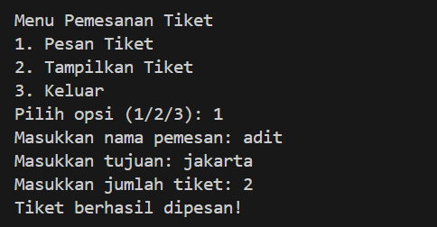
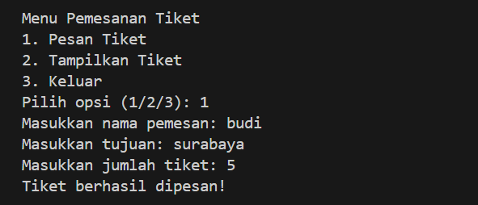

# projectuas
DAFTAR ISI
==========
- [LAPORAN PROGRAM PEMESANAN TIKET](#laporan-Program-Pemesanan-Tiket) 
    - [PSEUDECODE PROGRAM PEMESANAN TIKET](#pseudecode-program-pemesanan-tiket)
    - [KESIMPULAN](#kesimpulan)

## PSEUDECODE PROGRAM PEMESANAN TIKET
Berikut adalah program sederhana tentang pemesanan tiket yang dibagi menjadi 4 kelas yakni Data, View, Process, dan Main. Program ini juga mencakup validasi input dan menampilkan hasil dalam format tabel.

## Class Data
### Step 1 
Code Class ini digunakan untuk menyimpan dan mengelola data pemesanan tiket.

### Step 2
Dalam Program Ini Biasanya digunakan untuk Menginisialisasi penyimpanan awal untuk data tiket. dengan ini  konstruktor yang dijalankan saat objek dari class TicketData dapat dibuat atribut tickets, yaitu sebuah list kosong yang akan digunakan untuk menyimpan data tiket yang dipesan.

### Step 3
Kemudian code add_ticket ini biasanya Menyimpan data setiap kali pengguna memesan tiket.dengan ini data dapat menambahkan data tiket baru ke dalam list tickets.

Parameter:
    'name': Nama pemesan tiket.
    'destination': Tujuan tiket.
    'quantity': Jumlah tiket yang dipesan.

Langkah Kerja:
    - Membuat dictionary 'ticket' yang menyimpan informasi nama, tujuan, dan jumlah tiket.
    - Menambahkan dictionary tersebut ke list 'self.tickets'.

### Step 4
Lalu Bagian code terakhir ini digunakan untuk Memberikan akses ke data tiket untuk ditampilkan, diproses lebih lanjut, atau disimpan. dengan ini semua data dapat Mengembalikan daftar tiket yang telah dipesan.

Langkah Kerja:
    - Mengakses atribut 'self.tickets' yang berisi list semua data tiket.
    - Mengembalikan data tersebut ke bagian program lain yang membutuhkannya.

## Class View
### Step 1
Dalam Code Ticketview ini  Berfungsi sebagai komponen view dalam program (tampilan data kepada pengguna).dengan program ini metode display_tickets dapat mencetak daftar tiket yang dipesan ke layar.

### Step 2
Selanjutnya Code 'diplay' ini digunakan Mencetak daftar tiket secara terstruktur dalam format tabel.sedangkan 'tickets' berisi Daftar tiket (list of dictionaries) yang berisi informasi pemesanan

### Step 3
Kemudian pada tahap pengecekan data kosong ini berisi daftar tiket kosong (tickets tidak berisi data), program akan mencetak pesan: "Tidak ada tiket yang dipesan." Setelah mencetak pesan, fungsi akan berhenti menggunakan return.

### Step 4
Lalu bagian header tabel ini biasanya dilakukan Menampilkan data header tabel dengan kolom seperti
    - No: Nomor urut tiket.
    - Nama: Nama pemesan.
    - Tujuan: Tujuan perjalanan.
    - Jumlah: Jumlah tiket yang dipesan.

  

Format:
    - Gunakan format string untuk menyusun kolom dengan lebar tertentu:
    - <4: Kolom "No" memiliki lebar 4 karakter, rata kiri.
    - <20: Kolom "Nama" dan "Tujuan" masing-masing memiliki lebar 20 karakter.
    - <10: Kolom "Jumlah" memiliki lebar 10 karakter.

### Step 5
Pada bagian akhir ini codingan ini dilakukan iterasi melalui daftar tiket (tickets) menggunakan 'enumerate'.enumerate ini berisi Memberikan indeks (i) untuk setiap item dalam daftar dan dimulai dari angka 1 (start=1).

Format String:
    - Menyusun data setiap tiket berdasarkan kolom yang telah didefinisikan di header.
    - Akses data dari setiap tiket dengan ticket['name'], ticket['destination'], dan ticket['quantity'].

## Class Process

### Step 1
Pada code class TicketProcess ini biasanya dilakukan untuk mendefinisikan kelas bernama TicketProcess.

 

- __init__: Ini adalah konstruktor kelas yang dipanggil saat objek dari kelas ini dibuat. Konstruktor ini memiliki parameter data, yang diharapkan adalah objek yang memiliki metode untuk menambah tiket (seperti add_ticket).
- self.data = data: Ini menyimpan parameter data dalam atribut instance self.data, sehingga bisa diakses oleh metode lain dalam kelas.

### Step 2
Pada bagian code ini 'def add_ticket(self)'Ini digunakan untuk mendefinisikan metode add_ticket yang tidak memerlukan parameter tambahan selain instance self. sedangkan try itu dimulai blok try yang memungkinkan penanganan kesalahan jika terjadi selama proses di dalamnya.

 

Kelas TicketProcess berfungsi untuk mengelola proses pemesanan tiket dengan menerima input dari pengguna mengenai nama pemesan, tujuan perjalanan, dan jumlah tiket. Kelas ini juga melakukan validasi dasar terhadap jumlah tiket dan menangani kesalahan yang mungkin terjadi dengan memberikan umpan balik kepada pengguna.

- name = input("Masukkan nama pemesan: "): Mengambil input dari pengguna untuk nama pemesan.
- destination = input("Masukkan tujuan: "): Mengambil input dari pengguna untuk tujuan tiket.
- quantity = int(input("Masukkan jumlah tiket: ")): Mengambil input dari pengguna untuk jumlah tiket, dan mengkonversinya menjadi tipe int.
- if quantity < 1:: Mengecek apakah jumlah tiket yang dimasukkan kurang dari 1.
- raise ValueError("Jumlah tiket harus lebih dari 0."): Jika jumlah tiket kurang dari 1, maka raise (mengangkat) ValueError dengan pesan kesalahan yang sesuai.
- self.data.add_ticket(name, destination, quantity): Jika semua input valid, memanggil metode add_ticket pada self.data untuk menambahkan tiket dengan nama, tujuan, dan jumlah yang dimasukkan.
- print("Tiket berhasil dipesan!"): Mencetak pesan sukses jika tiket berhasil dipesan.
- except ValueError as e:: Menangkap ValueError yang mungkin terjadi, baik dari konversi jumlah tiket atau dari pengecekan jumlah tiket.
- print(f"Error: {e}"): Mencetak pesan kesalahan yang terjadi kepada pengguna

Dengan cara ini, TicketProcess berfungsi sebagai antarmuka antara pengguna yang ingin memesan tiket dan logika sistem yang membuat pemesanan tiket tersebut bisa terjadi.

## Class Main

### Step 1
pada tahap ini fungsinya ini untuk memanggil modul atau library yang dibutuhkan untuk menjalankan program.

- Modul TicketData berfungsi sebagai penyimpan data tiket,
- Modul TicketView berfungsi sebagai penggunaan tampilan data tiket,
- Modul TicketProcess berfungsi sebagai proses untuk menambahkan data tiket.

### Step 2
dalam bagian variable ini biasanya dilakukan untuk mendeklarasikan variabel yang akan digunakan di dalam program.

- Variabel ticket_data berfungsi sebagai penyimpanan data tiket,
- Variabel ticket_view berfungsi sebagai penggunaan tampilan data tiket,
- Variabel ticket_process berfungsi sebagai proses untuk menambahkan data tiket.

### Step 3
Fungsi ini untuk membuat loop yang akan terus berjalan sampai user memilih untuk keluar. dengan Loop ini akan menampilkan menu pilihan yang tersedia yaitu pesan tiket, tampilkan tiket, dan keluar.

### Step 4
kemudian bagian 'if-elif-else Statement' digunakan untuk untuk memproses pilihan yang dipilih oleh user.

- Jika user memilih opsi 1, maka program akan menambahkan tiket baru,
- Jika user memilih opsi 2, maka program akan menampilkan semua tiket yang tersedia,
- Jika user memilih opsi 3, maka program akan mengeluarkan pesan terima kasih dan berhenti menjalankan loop,
- Jika user memilih opsi lainnya, maka program akan menampilkan pesan bahwa pilihan tidak valid.

### Step 5
pada tahap terakhir fungsinya untuk memanggil fungsi main jika program dijalankan secara langsung.

## HASIL OUTPUT
Berikut adalah langkah-langkah dan hasil yang diharapkan saat program dijalankan:
1. Menampilkan Menu: Program akan menampilkan menu opsi untuk pemesanan tiket kepada pengguna.

2. Memilih Opsi:
- Jika pengguna memilih 1, program akan memanggil metode add_ticket() dari TicketProcess untuk menambahkan tiket. Dalam implementasi saat ini, tidak ada detail tentang bagaimana add_ticket() berfungsi, jadi kita tidak bisa melihat output yang tepat.
- Jika pengguna memilih 2, program akan mengambil tiket yang ada dari TicketData menggunakan metode get_tickets() dan menampilkan tiket tersebut dengan menggunakan metode display_tickets() dari TicketView. Hasil yang ditampilkan akan bergantung pada data tiket yang sudah ada.
- Jika pengguna memilih 3, program akan menampilkan pesan terima kasih dan keluar dari loop, menghentikan program.

3. Pada bagian handling input yang Tidak Valid: Jika pengguna memasukkan suatu pilihan yang tidak valid (misalnya, angka selain 1, 2, atau 3), program akan menampilkan pesan:

# Contoh Interaksi Pengguna:
Berikut adalah contoh interaksi pengguna saat menjalankan program:

* Pastikan modul TicketData, TicketProcess, dan TicketView sudah diimplementasikan dengan benar agar program dapat berjalan tanpa error.
* Implementasi dari add_ticket() dalam TicketProcess dan display_tickets() dalam TicketView tidak ditampilkan di sini, sehingga hasil spesifik dapat bervariasi berdasarkan kode yang tidak diberikan.

## KESIMPULAN
Program pemesanan tiket yang sederhana ini berhasil menampilkan struktur dasar dari aplikasi interaktif yang dapat digunakan untuk pemesanan dan pengelolaan tiket. Dengan beberapa pengembangan lebih lanjut, program ini bisa menjadi alat yang lebih lengkap dan bermanfaat dalam manajemen pemesanan tiket. 